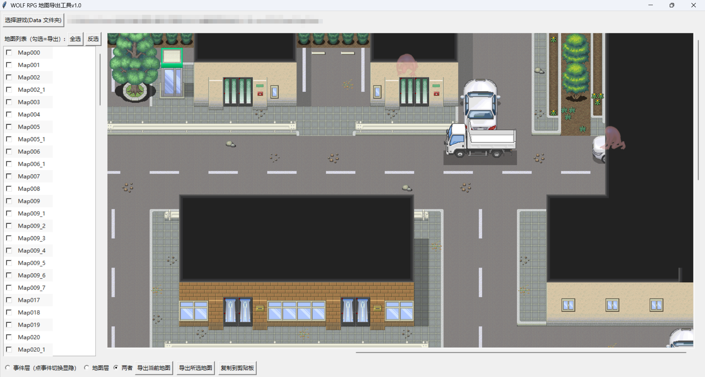

# WOLF RPG 地图导出工具 v1.0

  🌐 Language: <b>中文</b> · <a href="README.en.md">English</a> · <a href="README.ja.md">日本語</a>

  

一个完全离线的 **WOLF RPG Editor（ウディタ）地图渲染/导出工具**。无需打开编辑器即可把 `.mps` 地图渲染成 PNG 图片，并支持把**地图层**与**事件层**分开导出。

- 支持 0x65 / 0x66 / 0x67 三种地图格式混用
- 支持日文/中文文件名素材，可在非英文路径下运行
- 界面支持 **中文 / 日本語 / English** 切换（顶部菜单 Language），并自动检测系统语言
- 墙角自动图块规则表（aid 感知），跨游戏通用

## 文档

- **中文说明** → [README.zh.md](README.zh.md)
- **English** → [README.en.md](README.en.md)
- **日本語** → [README.ja.md](README.ja.md)

## Release

- [Releases](https://github.com/Dithree/WOLF-RPG-Map-Exporter/releases) — 包含 Windows 可执行版

## License

MIT

版本：1.1
